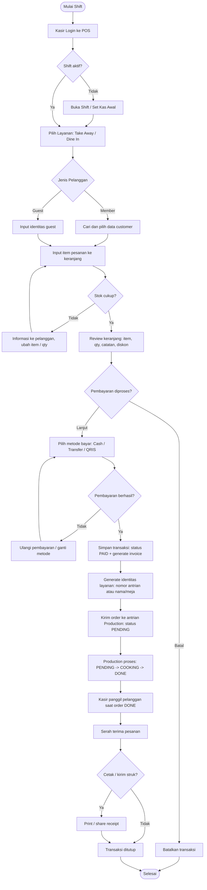

# Alur POS Cashier dan SOP Operasional

## 1. Tujuan
Dokumen ini menjadi panduan operasional kasir agar proses transaksi di POS berjalan konsisten, cepat, akurat, dan terdokumentasi.

## 2. Ruang Lingkup
Berlaku untuk seluruh aktivitas kasir mulai dari login, input pesanan, pembayaran, pengiriman pesanan ke production, sampai serah terima pesanan ke pelanggan.

## 3. Peran Terkait
- Cashier: input pesanan, proses pembayaran, cetak struk, serah terima.
- Production: proses pesanan dari antrian production sampai selesai.
- Supervisor/Admin: monitoring, approval khusus (jika ada void/refund/override).

## 4. Prasyarat Sebelum Operasional
- User kasir sudah login dengan akun resmi.
- Perangkat POS, printer, dan jaringan dalam kondisi normal.
- Pengaturan notifikasi suara aktif (jika digunakan).
- Data menu, harga, stok, dan promo sudah sinkron.

## 5. Flowchart Alur POS Cashier

## 6. SOP Operasional Kasir (Langkah Detail)

### 6.1 Persiapan Shift
1. Kasir login ke sistem POS menggunakan akun masing-masing.
2. Verifikasi shift aktif. Jika belum aktif, lakukan buka shift sesuai nominal kas awal.
3. Cek perangkat: printer struk, koneksi internet, scanner (jika ada).
4. Cek notifikasi suara dan tampilan antrian berjalan normal.

Output:
- Shift aktif dan siap menerima transaksi.

### 6.2 Input Pesanan
1. Pilih tipe layanan: Take Away atau Dine In.
2. Pilih customer (member) atau input guest.
3. Untuk Dine In, isi identitas yang berlaku (nama/meja).
4. Tambahkan item ke keranjang sesuai pesanan pelanggan.
5. Pastikan qty, catatan item, dan varian sudah benar.
6. Jika stok tidak cukup, tawarkan alternatif dan revisi keranjang.

Output:
- Keranjang valid dan siap dibayar.

### 6.3 Validasi Sebelum Bayar
1. Bacakan ulang pesanan ke pelanggan.
2. Konfirmasi total akhir termasuk diskon/promo (jika ada).
3. Pastikan tidak ada item ganda/salah qty.

Output:
- Pesanan terkonfirmasi pelanggan.

### 6.4 Proses Pembayaran
1. Pilih metode pembayaran yang diminta pelanggan.
2. Input nominal bayar.
3. Untuk cash: verifikasi uang diterima dan hitung kembalian.
4. Untuk non-cash: pastikan status transaksi benar-benar sukses.
5. Jika pembayaran gagal, ulangi atau ganti metode.

Output:
- Pembayaran sukses dan transaksi status PAID.

### 6.5 Setelah Pembayaran
1. Sistem generate nomor invoice otomatis.
2. Sistem generate identitas layanan:
   - Take Away: nomor antrian.
   - Dine In: nama pelanggan atau nomor meja.
3. Pesanan otomatis masuk ke antrian production (status PENDING).
4. Berikan informasi estimasi waktu ke pelanggan.

Output:
- Pesanan tercatat dan diteruskan ke production.

### 6.6 Koordinasi Dengan Production
1. Kasir memantau status order pada halaman terkait.
2. Saat status menjadi DONE, kasir panggil pelanggan.
3. Panggilan dilakukan dengan suara/notifikasi sesuai pengaturan sistem.

Output:
- Pelanggan dipanggil saat pesanan siap.

### 6.7 Serah Terima Pesanan
1. Cocokkan identitas pesanan (invoice/antrian/nama/meja).
2. Serahkan pesanan ke pelanggan dengan konfirmasi singkat.
3. Cetak atau kirim struk bila diminta.
4. Tutup transaksi.

Output:
- Pesanan diterima pelanggan dan transaksi selesai.

### 6.8 Penanganan Kondisi Khusus
1. Pembayaran gagal:
   - Jangan ubah status jadi PAID.
   - Ulangi proses pembayaran sampai sukses.
2. Salah input sebelum bayar:
   - Edit keranjang atau batalkan item.
3. Komplain setelah bayar:
   - Ikuti alur retur/void/refund sesuai otorisasi supervisor.
4. Gangguan sistem/printer:
   - Catat kejadian, informasikan supervisor, gunakan prosedur fallback manual.

## 7. Kontrol dan Checklist Harian
- Semua transaksi harus memiliki invoice.
- Tidak boleh ada order tanpa status pembayaran jelas.
- Selisih kas harus direkonsiliasi saat tutup shift.
- Semua void/refund harus tercatat dengan alasan dan approval.
- Log aktivitas kasir harus dapat ditelusuri.

## 8. KPI Operasional yang Disarankan
- Waktu rata-rata input sampai bayar selesai.
- Tingkat transaksi gagal bayar.
- Jumlah komplain karena salah order.
- Waktu tunggu dari PAID sampai DONE.
- Akurasi kas saat tutup shift.

---
Dokumen ini bisa dijadikan SOP resmi tim cashier dan bahan training onboarding kasir baru.
